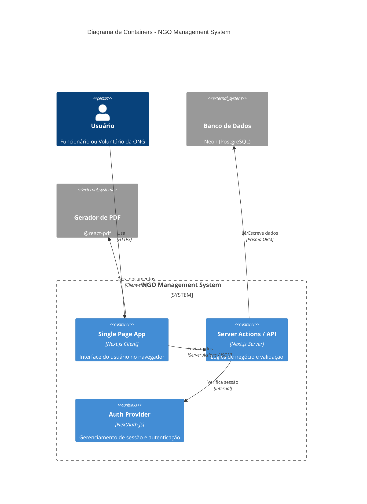
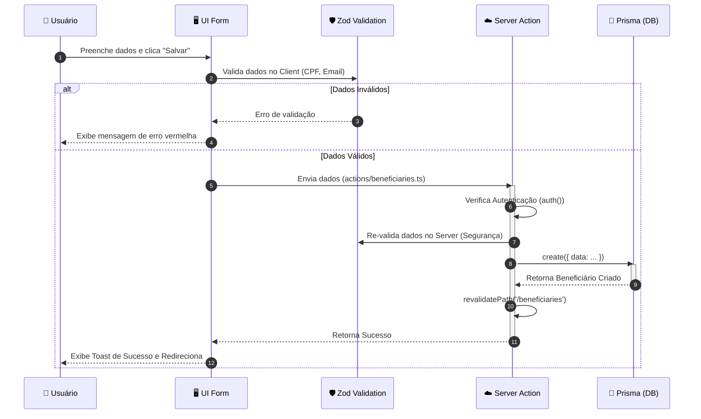

# 📊 Diagramas Visuais da Arquitetura

Este documento contém representações visuais da arquitetura, fluxo de dados e infraestrutura do sistema, utilizando a sintaxe **Mermaid.js**.

> ⚠️ **Nota sobre o Banco de Dados:** Para visualizar o Diagrama Entidade-Relacionamento (ERD) detalhado das tabelas e colunas, consulte o documento dedicado: [04_MODELAGEM_DE_DADOS.md](./04_MODELAGEM_DE_DADOS.md).

---

## 1. Arquitetura de Containers (Modelo C4)

Este diagrama mostra os principais "containers" do sistema e como eles interagem. Ele define as fronteiras da aplicação.



---

## 2. Fluxo de Lógica (Sequence Diagram)

Detalhe do fluxo de **Registro de Beneficiário**, mostrando a validação e a natureza assíncrona das Server Actions.



---

## 3. Infraestrutura (Deployment Diagram)

Mapa da infraestrutura de deploy na Vercel e serviços conectados.

```mermaid
graph TD
    subgraph Client_Device [📱 Dispositivo do Cliente]
        Browser[Navegador Web]
    end

    subgraph Vercel_Cloud [☁️ Vercel Cloud]
        Edge[⚡ Edge Network / CDN]
        Serverless[⚙️ Serverless Functions (Next.js)]
    end

    subgraph Data_Layer [💾 Camada de Dados]
        Neon[(Neon PostgreSQL)]
    end

    subgraph CI_CD [🔄 CI/CD]
        GitHub[GitHub Repository]
    end

    Browser -- HTTPS --> Edge
    Edge -- Roteamento --> Serverless
    Serverless -- Prisma Connection Pool --> Neon
    GitHub -- Git Push (Trigger Deploy) --> Vercel_Cloud
```

---

## 4. Mapa de Rotas (App Router Tree)

Visualização da estrutura de diretórios e rotas dentro de `app/`.

```mermaid
graph TD
    Root["/ (app)"]
    
    subgraph Public [Rotas Públicas]
        Login["/login"]
    end
    
    subgraph Protected [Rotas Protegidas (Dashboard)]
        Layout["layout.tsx (Sidebar + Header)"]
        Home["/ (Dashboard Home)"]
        
        subgraph Modules [Módulos]
            Beneficiaries["/beneficiaries"]
            Donations["/donations"]
            Consultas["/consultas (Data Explorer)"]
            Inventory["/inventory"]
            Financial["/financial"]
            Volunteers["/volunteers"]
            Distributions["/distributions"]
        end
    end

    Root --> Public
    Root --> Protected
    Protected --> Layout
    Layout --> Home
    Layout --> Modules
```

---

## 5. Arquitetura Lógica em Camadas (Logical Layers)

Este diagrama mapeia os conceitos do T3 Stack para a arquitetura clássica em camadas, facilitando o entendimento acadêmico.

```mermaid
graph TD
    subgraph Presentation [1. Camada de Apresentação (Frontend)]
        UI[Pages & Components]
        style UI fill:#e1f5fe,stroke:#01579b,stroke-width:2px
    end

    subgraph Service [2. Camada de Serviço/Controller (Backend Logic)]
        Action[Server Actions]
        Auth[Auth.js]
        Zod[Zod Validation]
        style Action fill:#fff9c4,stroke:#fbc02d,stroke-width:2px
    end

    subgraph DataAccess [3. Camada de Acesso a Dados (Persistence)]
        Prisma[Prisma Client]
        style Prisma fill:#e8f5e9,stroke:#2e7d32,stroke-width:2px
    end

    subgraph Database [4. Camada de Banco de Dados (Storage)]
        Neon[(Neon PostgreSQL)]
        style Neon fill:#f3e5f5,stroke:#7b1fa2,stroke-width:2px
    end

    %% Fluxo
    UI -- "1. Request (Form Submit)" --> Action
    Action -- "2. Auth Check" --> Auth
    Action -- "3. Validate" --> Zod
    Action -- "4. Call DB" --> Prisma
    Prisma -- "5. SQL Query" --> Neon
    Neon -- "6. Raw Data" --> Prisma
    Prisma -- "7. Typed Object" --> Action
    Action -- "8. Response (UI Update)" --> UI
```
