# 🏰 Entendendo a Arquitetura do Sistema

Este documento é o mapa do tesouro 🗺️. Ele explica como o projeto está organizado, quais tecnologias usamos e como elas conversam entre si.

---

## 🏗️ O "T3 Stack" (Nossa Caixa de Ferramentas)

Não escolhemos as tecnologias aleatoriamente. Usamos o **T3 Stack**, que é famoso por ser seguro, rápido e "Type-Safe" (o TypeScript te avisa dos erros antes de você rodar o código).

| Tecnologia | Função | Analogia |
| :--- | :--- | :--- |
| **Next.js** | Framework Fullstack | É a estrutura da casa (paredes, teto, divisões). |
| **TypeScript** | Linguagem | É o engenheiro que não deixa você construir uma parede torta. |
| **Tailwind CSS** | Estilização | É a tinta e a decoração. |
| **Prisma** | ORM (Banco de Dados) | É o tradutor que fala a língua do banco de dados. |
| **NextAuth.js** | Autenticação | É o segurança da portaria. |

---

## 📂 Estrutura de Pastas (Onde está cada coisa?)

O projeto pode parecer grande, mas tudo tem seu lugar. Aqui está o guia:

```
/
├── 📁 actions/          # 🧠 CÉREBRO (Backend)
│   └── (Aqui ficam as Server Actions. Toda lógica de salvar/editar dados está aqui)
│
├── 📁 app/              # 👁️ VISÃO (Frontend - Rotas)
│   ├── (dashboard)/     # Área logada (painel administrativo)
│   ├── api/             # Rotas de API (usamos pouco, pois preferimos Server Actions)
│   ├── login/           # Página de login pública
│   ├── layout.tsx       # O "esqueleto" comum de todas as páginas
│   └── page.tsx         # A página inicial
│
├── 📁 components/       # 🧱 TIJOLOS (Pedaços de UI)
│   ├── forms/           # Formulários complexos (Client Components)
│   ├── ui/              # Botões, Inputs, Cards (Componentes visuais básicos)
│   └── pdf/             # Geradores de documentos PDF
│
├── 📁 lib/              # 🔧 FERRAMENTAS (Utilitários)
│   ├── prisma.ts        # Conexão com o banco
│   └── schemas/         # Validações Zod (Regras de negócio)
│
├── 📁 prisma/           # 💾 DADOS
│   └── schema.prisma    # O desenho do nosso banco de dados
│
└── 📄 auth.ts           # Configuração de Login e Sessão
```

---

## 🔄 Fluxo de Dados (Como a informação viaja?)

Entender o caminho que o dado faz é essencial. Vamos ver o exemplo de **"Criar um Beneficiário"**:

### 1. O Caminho Feliz 😊

```mermaid
sequenceDiagram
    participant U as Usuário 👤
    participant F as Navegador (Frontend) 🖥️
    participant S as Servidor (Backend) ☁️
    participant DB as Banco de Dados 💾

    U->>F: Preenche formulário e clica "Salvar"
    F->>F: Zod valida dados (CPF válido? Email certo?)
    
    alt Dados Inválidos ❌
        F-->>U: Mostra erro vermelho na hora
    else Dados Válidos ✅
        F->>S: Envia dados (Server Action)
        Note over S: "actions/beneficiaries.ts"
        
        S->>S: Verifica se está Logado (auth)
        S->>S: Re-valida dados com Zod (Segurança dupla!)
        
        S->>DB: Prisma: "Crie esse beneficiário!"
        DB-->>S: "Criado! ID é 123"
        
        S->>S: RevalidatePath (Limpa cache)
        S-->>F: "Sucesso!"
        
        F-->>U: Mostra Toast verde e muda de página
    end
```



---

## ⚡ Server Components vs Client Components

Essa é a maior dúvida de quem começa com Next.js moderno (App Router).

### 🟢 Server Components (O Padrão)
Imagine que esses componentes rodam **dentro do servidor da Vercel**.
- **Poderes:** Podem ler banco de dados, acessar senhas secretas.
- **Fraquezas:** Não sabem o que é um "clique", não têm `useState`.
- **Uso:** Páginas de listagem, Dashboards, Cabeçalhos estáticos.
- **Exemplo:** `app/(dashboard)/beneficiaries/page.tsx`

### 🔵 Client Components (`"use client"`)
Imagine que esses componentes são enviados para o **computador do usuário** e rodam lá.
- **Poderes:** Ouvem cliques, digitam em formulários, usam `useEffect`.
- **Fraquezas:** Não podem tocar no banco de dados diretamente (inseguro).
- **Uso:** Botões, Formulários, Menus interativos.
- **Exemplo:** `components/forms/beneficiary-form.tsx`

> **Regra de Ouro:** Tente fazer tudo como Server Component. Só use Client Component quando precisar de interatividade (clique, estado, efeitos).

---

## 🧠 Gerenciamento de Estado: URL vs React State

Uma das decisões mais importantes na arquitetura do "Data Explorer" (Consultas) foi onde guardar o estado dos filtros.

### ❌ O Jeito "Amador" (React State)
Guardar filtros em `useState`:
```tsx
const [search, setSearch] = useState('');
```
- **Problema:** Se você der F5, perde tudo.
- **Problema:** Você não pode mandar o link da busca para seu chefe ("Olha as distribuições da Maria").

### ✅ O Jeito "Senior" (URL Search Params)
Guardar filtros na URL: `?search=Maria&page=2`
- **Vantagem:** O estado é global e persistente.
- **Vantagem:** Compartilhável (Deep Linking).
- **Como funciona:**
    1. O usuário digita.
    2. Atualizamos a URL (`router.replace`).
    3. O Server Component lê a URL (`searchParams`).
    4. O Server Action busca no banco com base nesses parâmetros.

Isso também permite **Server-Side Filtering**, tirando o peso do navegador do usuário e processando tudo no servidor, que é muito mais rápido.

---

## 🛡️ Camadas de Segurança

Não confiamos em ninguém. Por isso temos segurança em várias camadas:

1.  **Frontend (Zod):** Ajuda o usuário honesto a não errar (ex: avisa que o email está sem @).
2.  **Middleware:** O porteiro que barra quem não tem crachá (login) antes de entrar na festa.
3.  **Backend (Zod):** Protege contra hackers que tentam burlar o frontend enviando dados falsos direto para o servidor.
4.  **Database (Prisma):** Garante a integridade final (ex: não deixa criar dois usuários com o mesmo email).

---

## 🚀 Dicas para Desenvolver

1.  **Comece pelo Schema:** Vai criar uma feature nova? Primeiro desenhe ela no `schema.prisma`.
2.  **Crie a Server Action:** Faça a função que salva/busca os dados.
3.  **Crie a UI:** Só depois faça a tela e o formulário.
4.  **Use os Logs:** Deixamos o Prisma mostrando as queries SQL no terminal. Olhe para ele para entender o que está acontecendo!
