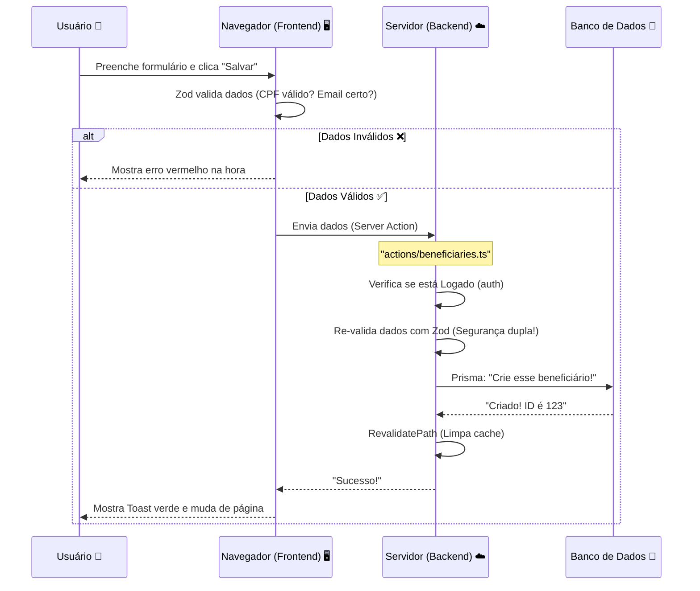
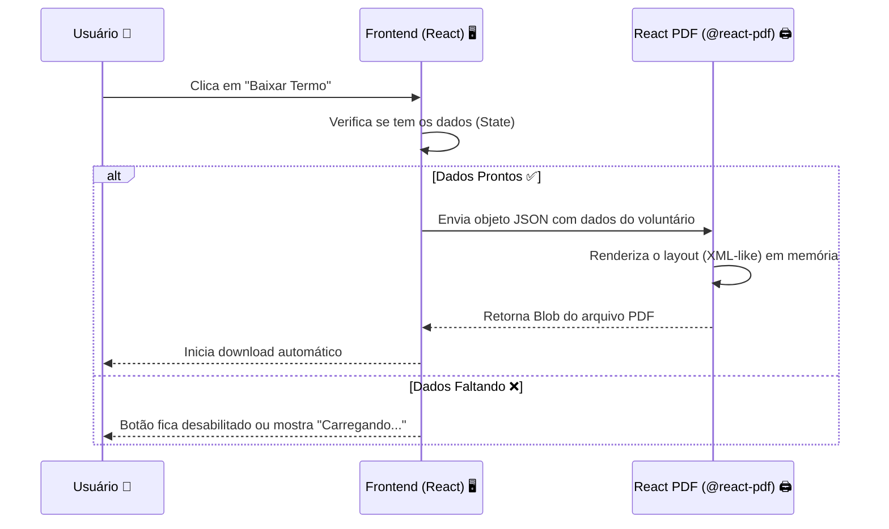

# 🏰 Entendendo a Arquitetura do Sistema

Este documento é o mapa do tesouro 🗺️. Ele explica como o projeto está organizado, quais tecnologias usamos e como elas conversam entre si.

---

## 🏗️ O "T3 Stack" (Nossa Caixa de Ferramentas)

Não escolhemos as tecnologias aleatoriamente. Usamos o **T3 Stack**, que é famoso por ser seguro, rápido e "Type-Safe" (o TypeScript te avisa dos erros antes de você rodar o código).

| Tecnologia | Função | Analogia |
| :--- | :--- | :--- |
| **Next.js** | Framework Fullstack | É a estrutura da casa (paredes, teto, divisões). |
| **TypeScript** | Linguagem | É o engenheiro que não deixa você construir uma parede torta. |
| **Tailwind CSS** | Estilização | É a tinta e a decoração. |
| **Prisma** | ORM (Banco de Dados) | É o tradutor que fala a língua do banco de dados. |
| **NextAuth.js** | Autenticação | É o segurança da portaria. |
| **React PDF** | Geração de Documentos | É a impressora que cria documentos oficiais na hora. |

---

## 📂 Estrutura de Pastas (Onde está cada coisa?)

O projeto pode parecer grande, mas tudo tem seu lugar. Aqui está o guia:

```
/
├── 📁 actions/          # 🧠 CÉREBRO (Backend)
│   └── (Aqui ficam as Server Actions. Toda lógica de salvar/editar dados está aqui)
│
├── 📁 app/              # 👁️ VISÃO (Frontend - Rotas)
│   ├── (dashboard)/     # Área logada (painel administrativo)
│   ├── api/             # Rotas de API (usamos pouco, pois preferimos Server Actions)
│   ├── login/           # Página de login pública
│   ├── layout.tsx       # O "esqueleto" comum de todas as páginas
│   └── page.tsx         # A página inicial
│
├── 📁 components/       # 🧱 TIJOLOS (Pedaços de UI)
│   ├── forms/           # Formulários complexos (Client Components)
│   ├── ui/              # Botões, Inputs, Cards (Componentes visuais básicos)
│   └── pdf/             # Geradores de documentos PDF
│
├── 📁 docs/             # 📚 BIBLIOTECA (Documentação)
│   └── (Manuais, guias e diagramas para entender o projeto)
│
├── 📁 hooks/            # 🎣 ANZÓIS (Lógica Reutilizável)
│   └── (Pequenas funções que "pescam" funcionalidades do React para usar em vários lugares)
│
├── 📁 lib/              # 🔧 FERRAMENTAS (Utilitários)
│   ├── prisma.ts        # Conexão com o banco
│   └── schemas/         # Validações Zod (Regras de negócio)
│
├── 📁 prisma/           # 💾 DADOS
│   └── schema.prisma    # O desenho do nosso banco de dados
│
├── 📁 public/           # 🖼️ GALERIA (Arquivos Estáticos)
│   └── (Imagens, logos e arquivos que são acessados publicamente)
│
├── 📁 types/            # 🏷️ ETIQUETAS (Definições de Tipos)
│   └── (Onde definimos o formato exato dos dados para o TypeScript não reclamar)
│
├── 📄 auth.ts           # Configuração de Login e Sessão
└── 📄 middleware.ts     # 👮 PORTEIRO (Segurança de Rotas)
```

---

## 🗂️ Lista Detalhada de Arquivos

Abaixo, a árvore completa de arquivos do projeto para referência rápida:

```
```
/
├── 📁 actions/ # 🧠 Lógica de Backend (Server Actions)
│   ├── auth.ts # Ações de autenticação (login, logout)
│   ├── beneficiaries.ts # Criação e edição de beneficiários
│   ├── consultas.ts # Lógica de busca e filtros avançados
│   ├── distributions.ts # Registro de distribuição de itens
│   ├── donation.ts # Gerenciamento de doações recebidas
│   ├── financial.ts # Controle financeiro básico
│   ├── forms.ts # Processamento de formulários digitais
│   ├── institutions.ts # Gerenciamento de instituições parceiras
│   ├── inventory.ts # Controle de estoque
│   └── volunteers.ts # Gestão de voluntários
│
├── 📁 app/ # 👁️ Rotas e Páginas (Frontend)
│   ├── (dashboard)/ # Área logada (Painel Administrativo)
│   │   ├── beneficiaries/ # Gestão de beneficiários
│   │   ├── consultas/ # Busca avançada (Data Explorer)
│   │   ├── distributions/ # Registro de distribuições
│   │   ├── donations/ # Controle de doações
│   │   ├── financial/ # Painel financeiro
│   │   ├── inventory/ # Visualização de estoque
│   │   ├── volunteers/ # Gestão de voluntários
│   │   ├── layout.tsx # Layout base (Sidebar + Header)
│   │   └── page.tsx # Dashboard principal (Home)
│   ├── api/ # Rotas de API (pouco usadas)
│   ├── login/ # Página pública de login
│   ├── globals.css # Estilos globais (Tailwind)
│   └── layout.tsx # Layout raiz (HTML, Body)
│
├── 📁 components/ # 🧱 Componentes React
│   ├── forms/ # Formulários Interativos (Client Components)
│   │   ├── beneficiary-form.tsx # Cadastro de beneficiários
│   │   ├── donation-form.tsx # Registro de doações
│   │   ├── family-distribution-form.tsx # Distribuição para famílias
│   │   ├── image-authorization-form.tsx # Autorização de imagem
│   │   ├── institution-form.tsx # Cadastro de instituições
│   │   ├── institutional-distribution-form.tsx # Distribuição para instituições
│   │   ├── login-form.tsx # Formulário de login
│   │   ├── nutritionist-referral-form.tsx # Encaminhamento nutricional
│   │   ├── social-assessment-form.tsx # Avaliação social
│   │   ├── volunteer-form.tsx # Cadastro de voluntários
│   │   └── volunteer-termination-form.tsx # Desligamento de voluntários
│   ├── layout/ # Componentes estruturais
│   │   ├── header.tsx # Barra superior
│   │   └── sidebar.tsx # Menu lateral
│   ├── pdf/ # Geradores de documentos PDF
│   │   ├── activity-report.tsx # Relatório de atividades
│   │   ├── consultas-report-pdf.tsx # Relatório de consultas
│   │   ├── download-button.tsx # Botão genérico de download
│   │   ├── family-distribution-pdf.tsx # Comprovante de distribuição (família)
│   │   ├── image-authorization-pdf.tsx # Termo de imagem
│   │   ├── institutional-distribution-pdf.tsx # Comprovante de distribuição (instituição)
│   │   ├── nutritionist-referral-pdf.tsx # Encaminhamento nutricional
│   │   ├── pdf-download-button.tsx # Botão específico para PDFs
│   │   ├── social-assessment-pdf.tsx # Relatório de avaliação social
│   │   ├── volunteer-adhesion-pdf.tsx # Termo de adesão voluntária
│   │   └── volunteer-termination-pdf.tsx # Termo de desligamento
│   ├── shared/ # Componentes compartilhados
│   └── ui/ # Componentes base do shadcn/ui (Button, Input, etc.)
│
├── 📁 docs/ # 📚 Documentação do Projeto
│   ├── referencia_legada/ # Modelos antigos para referência
│   ├── 00_INDICE.md # Índice da documentação
│   ├── 01_GUIA_DE_ESTUDOS.md # Guia para iniciantes
│   ├── 02_ARQUITETURA_DO_SISTEMA.md # Este arquivo (Visão Geral)
│   ├── 03_DICIONARIO_TECNICO.md # Glossário de termos
│   ├── 04_MODELAGEM_DE_DADOS.md # Explicação do Banco de Dados
│   ├── 05_MANUAL_RODAR_LOCAL.md # Como rodar o projeto
│   ├── 06_MANUAL_DEPLOY_PRODUCAO.md # Como colocar no ar
│   ├── 07_STATUS_DO_PROJETO.md # O que está pronto/pendente
│   ├── 08_MELHORIAS_FUTURAS.md # Backlog de ideias
│   └── 09_DIAGRAMAS_VISUAIS.md # Diagramas de arquitetura
│
├── 📁 hooks/ # 🎣 Hooks Personalizados
│   ├── use-debounce.ts # Delay para input de busca
│   └── use-toast.ts # Notificações flutuantes
│
├── 📁 lib/ # 🔧 Utilitários e Configurações
│   ├── schemas/ # Validações Zod
│   │   └── domain.ts # Tipos e regras de negócio
│   ├── prisma.ts # Conexão com o Banco de Dados
│   └── utils.ts # Funções auxiliares gerais
│
├── 📁 prisma/ # 💾 Banco de Dados
│   ├── migrations/ # Histórico de mudanças no banco
│   ├── schema.prisma # Definição das tabelas e relações
│   └── seed.ts # Dados iniciais para teste
│
├── 📁 public/ # 🖼️ Arquivos Estáticos
│   ├── apresentacao/ # Slides e apresentações
│   ├── logo.jpeg # Logo em JPG
│   └── logo.png # Logo em PNG
│
├── 📁 types/ # 🏷️ Tipos TypeScript Globais
│   ├── index.ts # Tipos gerais
│   └── next-auth.d.ts # Extensão de tipos de autenticação
│
├── auth.config.ts # Configuração do NextAuth
├── auth.ts # Inicialização da autenticação
├── components.json # Configuração do shadcn/ui
├── eslint.config.mjs # Regras de qualidade de código
├── middleware.ts # Proteção de rotas (Porteiro)
├── next.config.ts # Configuração do Next.js
├── package.json # Dependências do projeto
├── postcss.config.mjs # Processador de CSS
├── README.md # Documentação inicial
└── tsconfig.json # Configuração do TypeScript
```

---

## 🔄 Fluxo de Dados (Como a informação viaja?)

Entender o caminho que o dado faz é essencial. Vamos ver o exemplo de **"Criar um Beneficiário"**:

### 1. O Caminho Feliz 😊



### 2. O Caminho do PDF (Geração de Documentos) 📄

A geração de PDFs acontece no lado do cliente (navegador) para ser instantânea e não sobrecarregar o servidor.



---

## ⚡ Server Components vs Client Components

Essa é a maior dúvida de quem começa com Next.js moderno (App Router).

### 🟢 Server Components (O Padrão)
Imagine que esses componentes rodam **dentro do servidor da Vercel**.
- **Poderes:** Podem ler banco de dados, acessar senhas secretas.
- **Fraquezas:** Não sabem o que é um "clique", não têm `useState`.
- **Uso:** Páginas de listagem, Dashboards, Cabeçalhos estáticos.
- **Exemplo:** `app/(dashboard)/beneficiaries/page.tsx`

### 🔵 Client Components (`"use client"`)
Imagine que esses componentes são enviados para o **computador do usuário** e rodam lá.
- **Poderes:** Ouvem cliques, digitam em formulários, usam `useEffect`.
- **Fraquezas:** Não podem tocar no banco de dados diretamente (inseguro).
- **Uso:** Botões, Formulários, Menus interativos.
- **Exemplo:** `components/forms/beneficiary-form.tsx`

> **Regra de Ouro:** Tente fazer tudo como Server Component. Só use Client Component quando precisar de interatividade (clique, estado, efeitos).

---

## 🧠 Gerenciamento de Estado: URL vs React State

Uma das decisões mais importantes na arquitetura do "Data Explorer" (Consultas) foi onde guardar o estado dos filtros.

### ❌ O Jeito "Amador" (React State)
Guardar filtros em `useState`:
```tsx
const [search, setSearch] = useState('');
```
- **Problema:** Se você der F5, perde tudo.
- **Problema:** Você não pode mandar o link da busca para seu chefe ("Olha as distribuições da Maria").

### ✅ O Jeito "Senior" (URL Search Params)
Guardar filtros na URL: `?search=Maria&page=2`
- **Vantagem:** O estado é global e persistente.
- **Vantagem:** Compartilhável (Deep Linking).
- **Como funciona:**
    1. O usuário digita.
    2. Atualizamos a URL (`router.replace`).
    3. O Server Component lê a URL (`searchParams`).
    4. O Server Action busca no banco com base nesses parâmetros.

Isso também permite **Server-Side Filtering**, tirando o peso do navegador do usuário e processando tudo no servidor, que é muito mais rápido.

---

## 🛡️ Camadas de Segurança

Não confiamos em ninguém. Por isso temos segurança em várias camadas:

1.  **Frontend (Zod):** Ajuda o usuário honesto a não errar (ex: avisa que o email está sem @).
2.  **Middleware:** O porteiro que barra quem não tem crachá (login) antes de entrar na festa.
3.  **Backend (Zod):** Protege contra hackers que tentam burlar o frontend enviando dados falsos direto para o servidor.
4.  **Database (Prisma):** Garante a integridade final (ex: não deixa criar dois usuários com o mesmo email).

---

## 🚀 Dicas para Desenvolver

1.  **Comece pelo Schema:** Vai criar uma feature nova? Primeiro desenhe ela no `schema.prisma`.
2.  **Crie a Server Action:** Faça a função que salva/busca os dados.
3.  **Crie a UI:** Só depois faça a tela e o formulário.
4.  **Use os Logs:** Deixamos o Prisma mostrando as queries SQL no terminal. Olhe para ele para entender o que está acontecendo!
