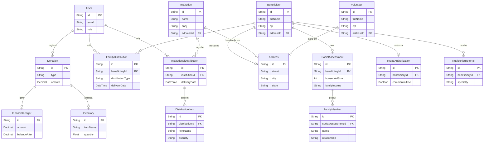

# 🗄️ Diagrama do Banco de Dados (ERD)

Este diagrama mostra visualmente como as tabelas do nosso banco de dados se relacionam. Ele é gerado automaticamente a partir do arquivo `prisma/schema.prisma`.

## 📝 Legenda

- **PK**: Primary Key (Chave Primária) - O ID único do registro.
- **FK**: Foreign Key (Chave Estrangeira) - O link para outra tabela.
- **||--o{**: Um para Muitos (Ex: Um Usuário registra Várias Doações).
- **||--o|**: Um para Um (Ex: Um Beneficiário tem Um Endereço).
