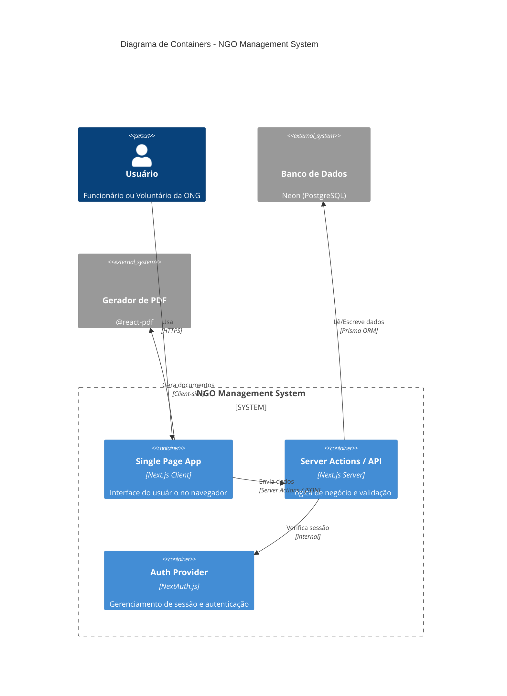
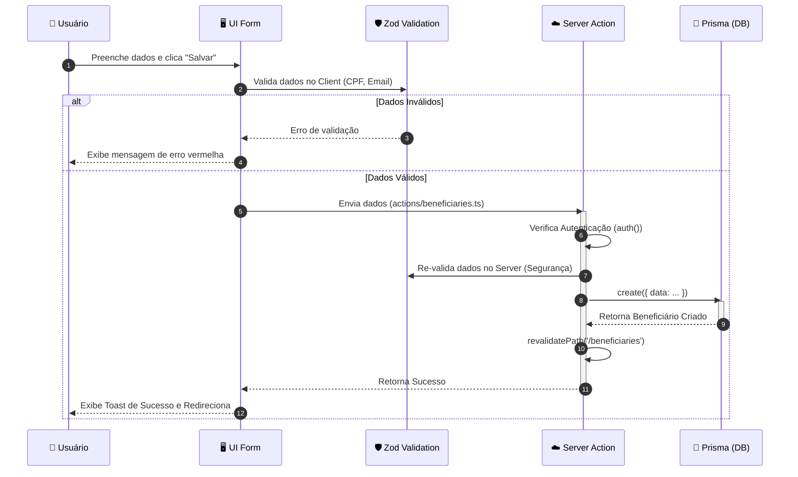
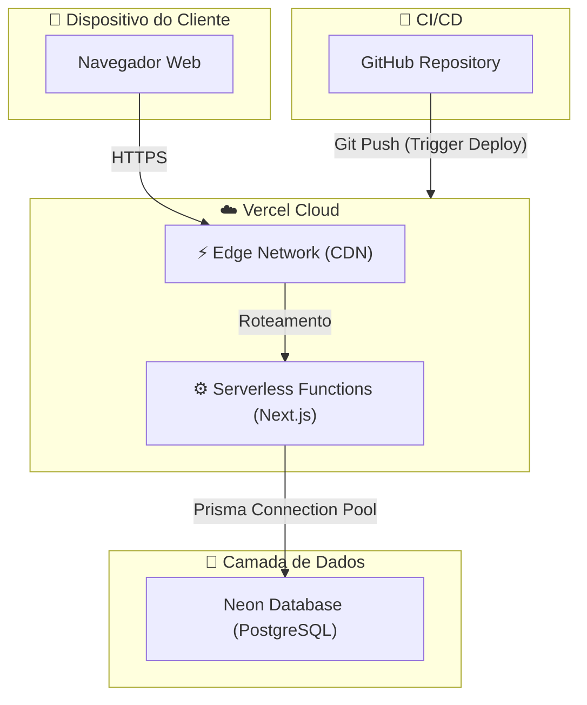
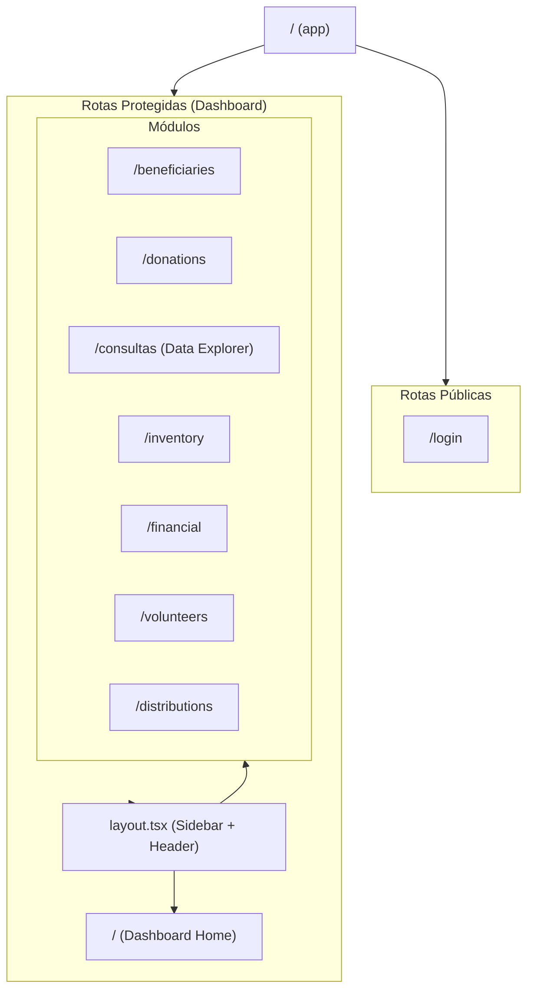
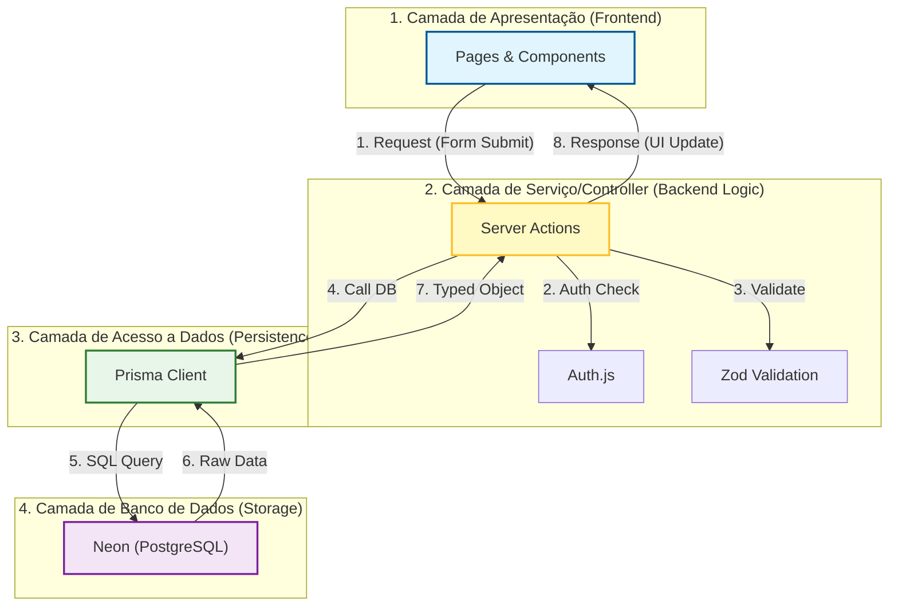

# 📊 Diagramas Visuais da Arquitetura

Este documento contém representações visuais da arquitetura, fluxo de dados e infraestrutura do sistema, utilizando a sintaxe **Mermaid.js**.

> ⚠️ **Nota sobre o Banco de Dados:** Para visualizar o Diagrama Entidade-Relacionamento (ERD) detalhado das tabelas e colunas, consulte o documento dedicado: [04_MODELAGEM_DE_DADOS.md](./04_MODELAGEM_DE_DADOS.md).
>
> 🗺️ **Nota sobre Dependências:** Para ver quem importa quem (fluxo de arquivos), veja o [10_MAPA_DE_DEPENDENCIAS.md](./10_MAPA_DE_DEPENDENCIAS.md).

---

## 1. Arquitetura de Containers (Modelo C4)

Este diagrama mostra os principais "containers" do sistema e como eles interagem. Ele define as fronteiras da aplicação.

---

## 2. Fluxo de Lógica (Sequence Diagram)

Detalhe do fluxo de **Registro de Beneficiário**, mostrando a validação e a natureza assíncrona das Server Actions.

---

## 3. Infraestrutura (Deployment Diagram)

Mapa da infraestrutura de deploy na Vercel e serviços conectados.

---

## 4. Mapa de Rotas (App Router Tree)

Visualização da estrutura de diretórios e rotas dentro de `app/`.

---

## 5. Arquitetura Lógica em Camadas (Logical Layers)

Este diagrama mapeia os conceitos do T3 Stack para a arquitetura clássica em camadas, facilitando o entendimento acadêmico.

