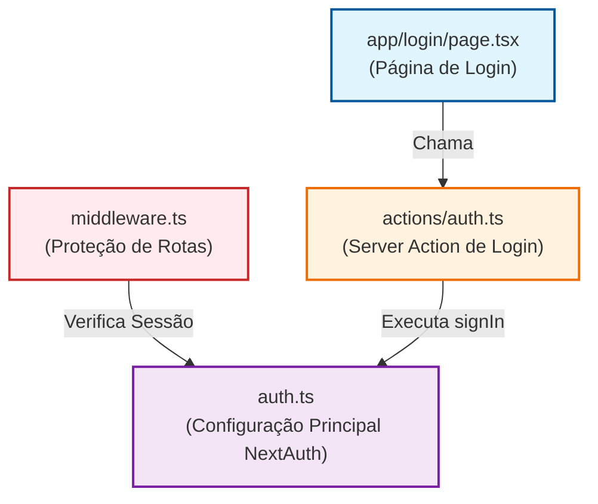
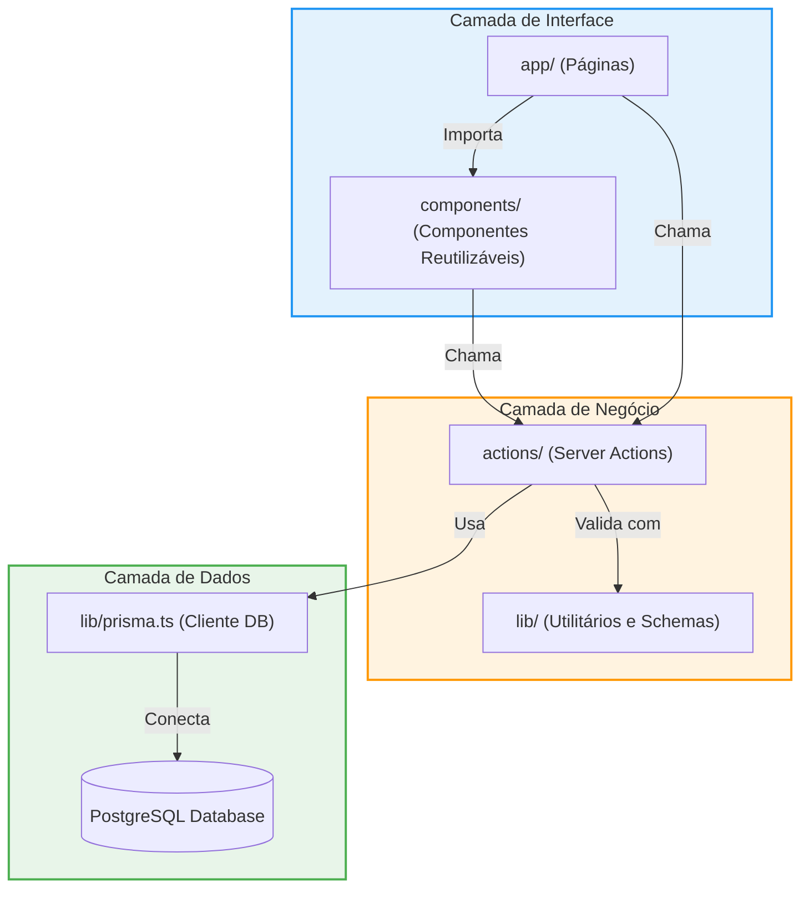

# Mapa de Dependências do Projeto

Este documento tem como objetivo ilustrar visualmente como os dados fluem através do sistema, desde a interface do usuário (Frontend) até o banco de dados (Backend), passando pelas camadas de lógica de negócios (Actions).

Abaixo estão diagramas gerados com **Mermaid** que mapeiam as conexões críticas entre os arquivos.

## 1. Fluxo de Doações (Exemplo de Feature)

Este diagrama mostra como a funcionalidade de "Doações" está estruturada. O usuário interage com a **Página**, que usa um **Formulário**. O formulário envia dados para uma **Server Action**, que valida e salva no **Banco de Dados** via **Prisma**.

```mermaid
graph TD
    %% Nós (Arquivos)
    Page["app/(dashboard)/donations/page.tsx<br>(Página de Listagem/Criação)"]
    Form["components/forms/donation-form.tsx<br>(Formulário Interativo)"]
    Action["actions/donation.ts<br>(Lógica de Servidor)"]
    PrismaLib["lib/prisma.ts<br>(Conexão Singleton DB)"]
    Schema["prisma/schema.prisma<br>(Definição do Banco)"]

    %% Estilos
    style Page fill:#e1f5fe,stroke:#01579b,stroke-width:2px
    style Form fill:#e3f2fd,stroke:#0277bd,stroke-width:2px
    style Action fill:#fff3e0,stroke:#ef6c00,stroke-width:2px
    style PrismaLib fill:#f3e5f5,stroke:#7b1fa2,stroke-width:2px
    style Schema fill:#eceff1,stroke:#455a64,stroke-width:2px

    %% Conexões
    Page -->|Importa e Renderiza| Form
    Form -->|Chama Server Action (onSubmit)| Action
    Action -->|Importa| PrismaLib
    PrismaLib -->|Lê/Escreve| Schema
```

## 2. Fluxo de Autenticação (Auth)

Este diagrama ilustra como o **NextAuth.js** está integrado. O `middleware` protege as rotas, verificando a sessão configurada em `auth.ts`.



## 3. Arquitetura Global (Visão de Alto Nível)

Uma visão macro de como as pastas do projeto se relacionam. A **UI** (Interface) depende do **Core** (Lógica), que por sua vez depende dos **Dados** (Persistência).


